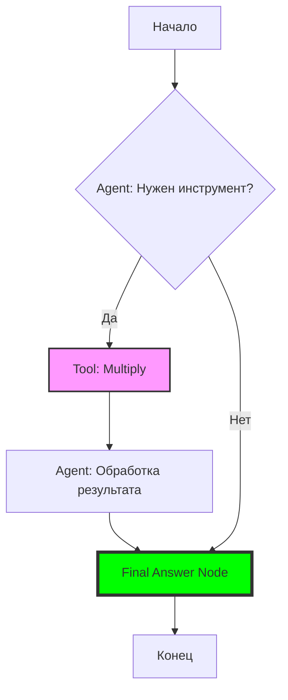

# Умный Калькулятор на LangGraph

Интерактивный калькулятор, построенный на базе **LangGraph** и **OpenRouter (Gemini 2.0 Flash)**. Он использует концепцию «чувств» агента (Function Calling), чтобы решать математические задачи.

## 🚀 Как это работает

Агент использует граф состояний для принятия решений:
1.  **Decision Node**: Модель анализирует вопрос и решает, нужен ли ей инструмент умножения.
2.  **Tool Node**: Если нужно умножение, выполняется Python-функция `multiply`.
3.  **Final Answer Node**: Программный узел, который гарантирует, что в финальном ответе будут именно те числа, которые использовались в расчете (защита от галлюцинаций LLM).

## 📊 Архитектура (Mermaid)



## 🛠️ Установка

1. Склонируйте репозиторий.
2. Создайте виртуальное окружение:
   ```bash
   python -m venv venv
   source venv/bin/activate  # Для Windows: venv\Scripts\activate
   ```
3. Установите зависимости:
   ```bash
   pip install langgraph langchain-openai python-dotenv
   ```
4. Создайте файл `.env` и добавьте свой ключ OpenRouter:
   ```env
   OPENROUTER_API_KEY=your_key_here
   ```

## 💻 Использование

Запустите скрипт:
```bash
python main.py
```
Введите свой вопрос, например: *"Сколько будет 123 умножить на 456?"*

---
Построено с помощью **AntiGravity**.
